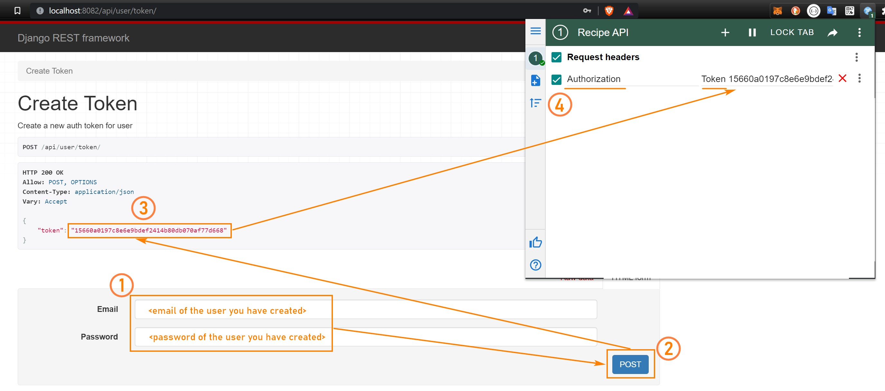

# Project setup (contenerized)

## Prerequisites

1. [docker](https://docs.docker.com/get-docker/)
2. [docker-compose](https://docs.docker.com/compose/install/)
3. [Optional & Recommended] **GNU make** (see below)

### GNU make - Make use of _Makefile_

It is recommended to make use of _make_ commands and in order to do so install _GNU make_

- Unix/Linux -> ready-to-go [more info](https://makefiletutorial.com/#running-the-examples)
- Windows (Powershell) -> [install chocolatey](https://chocolatey.org/install) and then run `choco install make` in **Powershell**
- MacOS -> TODO

## Development Environment

**Mind that all below commands can be run natively using docker-compose (not recommended, see _Makefile_ for details)**

### Prepare development environment

```
make build-dev-env
```

### Run development environment

```
make run-dev-env
```

### Run development environment interactively

```
make run-dev-env-it
```

### Run both unit-tests and lint-tests (using flake8)

```
make run-unit-tests
```

### Run unit-tests with coverage report (simple)

```
make run-ut-coverage-report
```

### Run unit-tests with coverage html report (enriched)

```
make run-ut-coverage-html
```

### Shut down and clean development environment

```
make down-dev-env
```

# Project usage

## Prerequisites

1. [ModHeader](https://modheader.com/) Chrome extension (or similar)

## Users

### Create new user on:

http://localhost:8082/api/user/create/

### Get your authorization token by logging to:

http://localhost:8082/api/user/token/

### Store your token in _ModHeader_ as a request header:

[](setup-modheader.jpg)

### Check your user data (and whether token works) on:

http://localhost:8082/api/user/me/

## Recipes

### Check available endpoints on

http://localhost:8082/api/recipe/

### Possible actions

You can send GET & POST request using either browser or Django simple forms.
Additionally, you can use 'assigned_only' parameter to list ingredients or tags assigned (1) to any recipe or not (0).
Default is 0.

http://localhost:8082/api/recipe/<tags|ingredients>/?assigned_only=<0|1>
